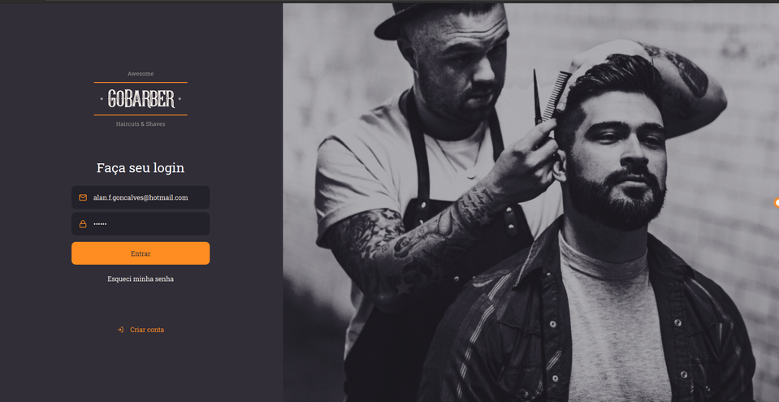

<h1 align="center">
  
</h1>

<h3 align="center">
  :rocket: [Bootcamp GoStack#10] GoBarber
</h3>

Projeto desenvolvido durante o Bootcamp da Rocketseat, estudando NodeJS, ReactJs e React Native.

### Algumas __features__
* Agendamento de clientes com prestadores de serviços
* Envio de email de cancelamento de um agendamento
* Sistema de notificação para os prestadores de serviços informando sobre os novos agendamentos.
* Horários disponíveis de um prestador de serviço.
* Autenticação (JWT) de clientes e prestadores de serviços.
* Upload de avatar

### Algumas tecnologias utilizadas:
* Sistema de notificações com MongoDB
* Envio de email usando Filas com Redis
* Error Tracking com Sentry
* PostgresQL
* Express

### Screen mobile

  
   
  
  
  
  

### Screen web

  
   
  
  

